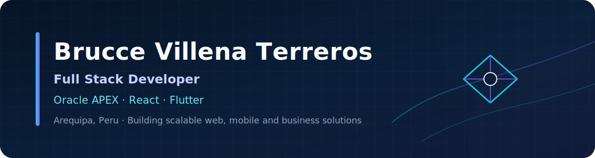

  

<h1 align="center">Full Stack Developer | Oracle APEX · React · Flutter</h1>

  
  
  

## About me / Sobre mí

**EN:** Bachelor's graduate in Systems and Computer Engineering, Full Stack Developer and higher-education instructor with more than five years of experience building web, mobile and enterprise systems. Specialized in **React frontend development** and business solutions with **Oracle APEX, PL/SQL, Node.js, Flutter, relational databases and NoSQL**. Experienced in financial, educational, livestock, logistics, retail and real-time auction platforms, with a focus on maintainable architecture, security, integrations, automation and user experience.

**ES:** Bachiller en Ingeniería de Sistemas e Informática, desarrollador Full Stack y docente de educación superior, con más de cinco años de experiencia en aplicaciones web, móviles y sistemas empresariales. Especializado en frontend con **React** y en soluciones de negocio con **Oracle APEX, PL/SQL, Node.js, Flutter, bases de datos relacionales y NoSQL**. Experiencia en plataformas financieras, educativas, ganaderas, logísticas, retail y subastas en tiempo real, con enfoque en arquitectura mantenible, seguridad, integraciones, automatización y experiencia de usuario.

> Open to high-impact software opportunities, challenging products and professional collaboration.  
> Abierto a oportunidades de software de alto impacto, productos desafiantes y colaboración profesional.

## Current focus / Enfoque actual

- Building and maintaining **FIMAKI**, a financial platform developed with Oracle APEX, PL/SQL and Oracle Database.  
  Desarrollo y mantenimiento de FIMAKI, plataforma financiera construida con Oracle APEX, PL/SQL y Oracle Database.
- Designing reusable frontend architectures with **React, TypeScript and modern state management**.  
  Diseño de arquitecturas frontend reutilizables con React, TypeScript y gestión moderna de estado.
- Teaching **Data Structures & Algorithms** and **Programming Languages** at Tecsup.  
  Docencia en Estructura de Datos y Algoritmos, y Lenguajes de Programación en Tecsup.
- Exploring practical uses of **AI, automation and multimedia processing**.  
  Exploración de usos prácticos de IA, automatización y procesamiento multimedia.

## Technology stack / Stack tecnológico

**Frontend**  

**Backend, enterprise & data**  

**Mobile, cloud & tooling**  

## Featured projects / Proyectos destacados

<table>
<tr>
<td width="50%" valign="top">

### [Professional Portfolio](https://github.com/BrucceVT/profile-web)
Modern bilingual portfolio with scalable frontend architecture, 3D elements and responsive interactions.

Portafolio bilingüe moderno con arquitectura frontend escalable, elementos 3D e interacciones responsivas.

`React 19` `TypeScript` `Three.js` `Tailwind CSS` `i18n`

</td>
<td width="50%" valign="top">

### [VideoScribe AI](https://github.com/BrucceVT/VideoScribe-AI)
AI-assisted audio and video transcription with configurable models, voice separation and text post-processing.

Transcripción de audio y video asistida por IA, con modelos configurables, separación de voz y posprocesamiento.

`Python` `Whisper` `Streamlit` `FFmpeg` `Demucs`

</td>
</tr>
<tr>
<td width="50%" valign="top">

### [Tamagochi React](https://github.com/BrucceVT/tamagochi-react)
Testable game architecture with domain logic separated from UI, global state and persistent data.

Arquitectura de juego comprobable, con lógica de dominio separada de la interfaz, estado global y persistencia.

`React` `TypeScript` `Zustand` `Vitest` `Tailwind CSS`

</td>
<td width="50%" valign="top">

### [Cobbleverse Server](https://github.com/BrucceVT/cobbleverse-server)
Containerized server infrastructure with health checks, operational scripts, backups and VPS deployment guidance.

Infraestructura de servidor en contenedores con health checks, scripts operativos, backups y despliegue en VPS.

`Docker Compose` `Bash` `Linux` `Automation` `Backups`

</td>
</tr>
</table>

## Professional experience / Experiencia profesional

### Tecsup — Instructor
**March 2026 — Present · Arequipa, Peru**

Teaching **Data Structures & Algorithms** and **Programming Languages** through theory sessions, laboratories, guided problem solving, projects, rubrics and competency-based assessment using Canvas LMS.  
Docencia en Estructura de Datos y Algoritmos, y Lenguajes de Programación mediante sesiones teóricas, laboratorios, resolución guiada de problemas, proyectos, rúbricas y evaluación por competencias en Canvas LMS.

### VirtualLabs — Full Stack Developer
**February 2024 — Present · Arequipa, Peru**

Developing and maintaining FIMAKI with Oracle APEX, PL/SQL and Oracle Database, including KYC, roles, credit-line proposals, factoring invoices, quotations, score validation, reconciliation, electronic documents and status-driven workflows. Also contributing to Contigo Pecuario, Tiacher, SGA, Stoply and Incatops across React, Flutter, Node.js, Django, Laravel and cloud integrations.  
Desarrollo y mantenimiento de FIMAKI con Oracle APEX, PL/SQL y Oracle Database, incluyendo KYC, roles, propuestas de líneas de crédito, facturas de factoring, cotizaciones, validación de scores, conciliaciones, comprobantes electrónicos y flujos por estados. Participación adicional en Contigo Pecuario, Tiacher, SGA, Stoply e Incatops.

### Previous experience / Experiencia previa

- **Frontend Developer — DeOcasion**, real-time auction platform with React and TypeScript (2023–2024).
- **Frontend Developer — Insource Consultora**, delivery, urban transport tracking and auction solutions (2023).
- **Full Stack Developer — Tecsup / Chinalco Project**, React, C# .NET Core and SQL Server (2021–2023).
- **Full Stack Developer — Fresco Minimarket**, React, Electron, MongoDB, SQL Server and AWS Lambda (2021).
- **Java Web Developer — Maderas Listas EIRL**, JSF, Servlets and MySQL (2020).

## Education / Formación

- **Bachelor's Degree in Systems and Computer Engineering — Universidad Tecnológica del Perú, 2026**  
  Grado de Bachiller en Ingeniería de Sistemas e Informática otorgado en junio de 2026.
- **Professional Technical Degree in Software Design and Systems Integration — Tecsup**  
  Título profesional técnico emitido en 2025.
- **Basic English Program — CEFR A2, 2024**  
  Centro Cultural Peruano Norteamericano.

## GitHub activity / Actividad en GitHub

  
  

  
  
  
  

## Contact

- **LinkedIn:** [linkedin.com/in/bruccevt](https://www.linkedin.com/in/bruccevt/)
- **Email:** [bvillena2000@gmail.com](mailto:bvillena2000@gmail.com)
- **Location:** Arequipa, Peru

Building useful software, sharing knowledge and continuously improving.

